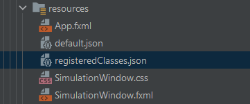

# **_Projekt Generator Ewolucyjny_**
#### autorzy: **Jakub Czajka**, **Karol Kiszka**
Projekt wykonany w ramach pierwszego projektu pt. _Generator Ewolucyjny_ na zajęcia z _Programowania Obiektowego_.

## Dokumentacja
Ta dokumentacja została napisana w celu ułatwienia korzystania z aplikacji i zapoznania się ze strukturą projektu.

### Opis projektu
***
Cały projekt został napisany od zera, nie korzystając z kodu, który został napisany na laboratoriach.

#### Podział pracą

Lista klas, za które odpowiedzialny jest Jakub Czajka:
- ConsumeEvent
- DeathEvent
- ConsumeEvent
- Event
- MoveEvent
- ReproduceEvent
- App
- AppController
- Animal
- Map
- Mappable
- Plant
- AnimalMap
- Earth
- Hell
- PlantMap
- ToxicCorpses
- WoodedEquator
- SimulationThread
- SimulationThreadGUI
- Simulation

Lista klas, za które odpowiedzialny jest Karol Kiszka:
- Brain
- NormalBrain
- RandomBrain
- ConsumeObserver
- DeathObserver
- MoveObserver
- Observable
- Observer
- ReproduceObserver
- CorrectiveGenome
- Genome
- RandomGenome
- SimulationTracker
- SimulationWindow
- SimulationWindowController
- Creature
- Eatable
- Environment
- Killable
- World
- WorldEnvironment
- AnimalMemory
- Memory
- Color
- Config
- CSVDumper
- Direction
- EasyPrint
- ExceptionHandler
- Pair
- Vector2
- Main

### Warianty symulacji
***
W wymaganiach oczekiwano od nas implementacji wielu różnych wariantów symulacji, które miały w różny sposób wpływać na przebieg symulacji.
Podział i implementacja tych wariantów, to zgodnie z oryginalną kolejnością:

#### Warianty mapy
> - kula ziemska — klasa **Earth**
> - piekielny portal — klasa **Hell**
> <!-- end of the list -->
> Klasa, która jest odpowiedzialna za implementacje metod wpływających na zachowanie mapy w przypadku ruchu zwierząt, to **AnimalMap**, po której obie klasy **Earth** i **Hell** dziedziczą.

#### Warianty wzrostu roślin
> - zalesione równiki — klasa **WoodedEquator**
> - toksyczne trupy — klasa **ToxicCorpses**
> <!-- end of the list -->
> Klasa, która jest odpowiedzialna za implementacje metod wpływających na generacje pól, które preferują i nie preferują rośliny, to **PlantMap**, po której obie klasy **WoodedEquator** i **ToxicCorpses** dziedziczą.

#### Warianty mutacji
> - pełna losowość — klasa **RandomGenome**
> - lekka korekta — klasa **CorrectiveGenome**
> <!-- end of the list -->
> Klasa, która jest odpowiedzialna za implementacje metod wpływających na mutacje genomów, to **Genome**, po której obie klasy **RandomGenome** i **CorrectiveGenome** dziedziczą.

#### Warianty zachowania
> - pełna predestynacja — klasa **NormalBrain**
> - nieco szaleństwa — klasa **RandomBrain**
> <!-- end of the list -->
> Klasa, która jest odpowiedzialna za implementacje metod wpływających na zachowanie zwierzaków poprzez wybór aktywnego genu, to **Brain**, po której obie klasy **NormalBrain** i **RandomBrain** dziedziczą.

Warto zauważyć, że struktura naszego projektu bardzo łatwo umożliwia dodanie nowych wariantów wpływających na przebieg symulacji, jedynie poprzez zaimplementowanie odpowiedniej klasy dziedziczącej po jednej z wymienionych wyżej klas i zarejestrowanie jej w odpowiednim pliku. Więcej informacji o tym procesie w [sekcji rozwój](#Rozwój).

### GUI
***
GUI zostało utworzone, zgodnie z wymaganiami korzystając z biblioteki _JavaFX_.

#### Okno ustawień

Po uruchomieniu aplikacji pierwsze okno, które się pojawi, to okno umożliwiające podanie dokładnych parametrów symulacji. Bazowo wszystkie pola zostaną wypełnione domyślnymi wartościami.

Aby wczytać ustawienia z utworzonego już wcześniej pliku konfiguracyjnego lub z jednego z plików szablonowych, wystarczy kliknąć guzik znajdujący się w prawym górnym rogu. Po jego kliknięciu należy wybrać odpowiedni, poprawnie sformatowany plik konfiguracyjny typu _json_. 

Dolna część okna pozwala określić docelową ilość ticków symulacji na sekundę, co oczywiście przy bardzo dużej wartości może nie osiągnąć takiej wielkości. Pod tym polem użytkownik może zaznaczyć czy chce, aby po wyłączeniu symulacji został utworzony plik CSV z informacjami o każdym dniu symulacji.

Dane wpisane przez użytkownika **muszą być poprawne** i **mieć sens**. W przypadku gdy, któraś wartość jest niepoprawna, symulacja nie zostanie uruchomiona.

##### Opis parametrów

- `mapSize` - parametr określający rozmiar mapy jej szerokość i wysokość
  - wartość musi być otoczona znakami `(` oraz `)`
  - szerokość i wysokość musi być dodatnia
- `animalMapType` - parametr określający wariant mapy zwierząt
  - wartość musi się zgadzać z nazwą istniejącej klasy, która jest zarejestrowana w pliku `src/main/resources/registeredClasses.json`
  - wielkość liter jest rozróżnialna
- `startingPlantCount` - parametr określający ilość roślin na początku symulacji
  - wartość musi być dodatnia
  - wartość musi być mniejsza bądź równa całkowitej powierzchni mapy
- `plantNutritionalValue` - parametr określający ilość energii, które po zjedzeniu rośliny otrzymują zwierzęta
  - wartość musi być dodatnia
- `plantGrowCount` - parametr określający ilość roślin, które wyrastają każdego dnia
  - wartość musi być dodatnia
- `plantMapType` - parametr określający wariant mapy roślin (wzrostu roślin)
  - wartość musi się zgadzać z nazwą istniejącej klasy, która jest zarejestrowana w pliku `src/main/resources/registeredClasses.json`
  - wielkość liter jest rozróżnialna
- `startingAnimalCount` - parametr określający ilość zwierząt na początku symulacji
  - wartość musi być dodatnia
  - wartość musi być mniejsza bądź równa całkowitej powierzchni mapy
- `startingAnimalEnergy` - parametr określający ilość energii początkowych zwierząt
  - wartość musi być dodatnia
- `reproduceRequiredEnergy` - parametr określający ilość energii wymaganą do reprodukcji zwierząt
  - wartość musi być dodatnia
- `reproduceEnergy` - parametr określający ilość energii traconą przez zwierzę w trakcie reprodukcji
  - wartość musi być dodatnia
  - wartość musi być mniejsza bądź równa `reproduceRequiredEnergy`
- `mutationCount` - parametr określający minimalną (wartość lewa) oraz maksymalną ilość mutacji genów
  - wartość musi być otoczona znakami `(` oraz `)`
  - wartość minimalna musi być mniejsza bądź równa wartości maksymalnej
  - wartość maksymalna musi być mniejsza bądź równa `genomeSize`
- `genomeType` - parametr określający wariant genomu zwierząt (mutacji genomów)
  - wartość musi się zgadzać z nazwą istniejącej klasy, która jest zarejestrowana w pliku `src/main/resources/registeredClasses.json`
  - wielkość liter jest rozróżnialna
- `genomeSize` - parametr określający minimalną (wartość lewa) oraz maksymalną ilość mutacji genów
  - wartość musi być dodatnia
- `brainType` - parametr określający wariant mózgu zwierząt (zachowania zwierząt)
  - wartość musi się zgadzać z nazwą istniejącej klasy, która jest zarejestrowana w pliku `src/main/resources/registeredClasses.json`
  - wielkość liter jest rozróżnialna
  
W folderze `configs/templates` znajduje się kilka szablonowych ustawień konfiguracyjnych, które mogą zostać wczytane.

#### Okno symulacji

Po podaniu lub wczytaniu ustawień konfiguracji i uruchomieniu symulacji pojawi się nowe okno, w którym zostanie uruchomiona symulacja.

W lewym górnym rogu znajduje się guzik umożliwiający zatrzymanie lub wznowienie symulacji.

Pod tym guzikiem znajdują się dwa mniejsze części okna odpowiedzialne za kolejno: wyświetlanie statystyk symulacji oraz wyświetlanie informacji o śledzonym zwierzaku.
Po prawej stronie znajduje się mapa symulacji z wyświetlonymi zwierzakami oraz polami, na których znajdują się rośliny.

Zielone pole oznacza roślinę na danym polu. Zwierzęta są wyświetlane za pomocą różowych kulek. Jej kolor oznacza ilość energii danego zwierzaka.
Kolor jest skalowany liniowo proporcjonalnie do ilości energii zwierzaka, kolor ciemny odpowiada energii równej 0, a kolor jasnoróżowy odpowiada energii równej 40.

Pod mapą znajdują się dwa guziki odpowiedzialne za kolejno od lewej: podświetlenie zwierzaków z najpopularniejszym genomem (wyświetlanym w części odpowiedzialnej za statystyki symulacji) kolorem fioletowym oraz zatrzymanie śledzenia zwierzaka.

Kliknięcie zwierzaka na mapie uruchamia jego śledzenie po uruchomieniu symulacji:

Warto dodać, że od teraz wybrany zwierzak będzie podświetlony kolorem żółtym (również proporcjonalnym do poziomu energii) przez cały czas, dopóki nie umrze lub przestaniemy go śledzić.
Opcja wyboru śledzonego zwierzaka i wyświetlenia zwierzaków z najpopularniejszym genomem jest dostępna **jedynie**, gdy symulacja jest zatrzymana.

Po zatrzymaniu symulacji poprzez zamknięcie okna zostanie utworzony plik konfiguracyjny w folderze `configs`
o nazwie odpowiadającej czasie uruchomienia symulacji (okno symulacji ma również tę samą nazwę). Jeżeli użytkownik wybrał opcje zapisywania danych symulacji do pliku
zostanie również utworzony plik w folderze `data` o tej samej nazwie.

Wartości w pliku CSV, to kolejno: ilość zwierząt, ilość roślin, ilość wolnych pól, najpopularniejszy genom, ilość zwierząt z tym genomem, średnia energia żyjących zwierząt, średnia długość życia zwierząt.

### Rozwój
***
#### Dodanie nowego wariantu symulacji

Proces dodania nowej klasy wpływającej na wariant zachowania symulacji jest bardzo prosty. Spróbujmy dodać do projektu nową klasę wpływającą na zachowanie zwierząt.
Będzie to nowa klasa definiująca mózg zwierzęcia, dziedzicząca po abstrakcyjnej klasie **Brain**. Klasa **Brain** wygląda następująco:

Interesuje nas jedynie implementacja metod `think()` oraz `copy()`. Metoda `think()` jest odpowiedzialna, za wybór następnego aktywnego genu, a metoda `copy()` jest wymagana w implementacji przez klasy dziedziczące, ponieważ klasa abstrakcyjna nie może zwrócić kopii własnej instancji.
Utwórzmy klasę **FullyRandomBrain**, której działanie będzie polegało na kompletnie losowym wyborze aktywnego genu.
Klasa ta musi zostać utworzona w odpowiednim katalogu, w przypadku mózgu, to `src/main/java/evolution/brains`:

Przykładowa implementacja:

Teraz jedyne co nam zostało, to zarejestrowanie naszej nowej klasy, aby inne klasy ją wykrywały. Plik odpowiedzialny za rejestracje klas, to `src/main/resources/registeredClasses.json`:

Teraz po wpisaniu `FullyRandomBrain` jako wartość parametru `brainType` zwierzaki będą korzystać z naszej nowej implementacji mózgu! Proces wygląda adekwatnie przy tworzeniu innych wariantów symulacji.

#### Inne możliwości

Struktura projektu została utworzoną z myślą dalszego, większego rozwoju aplikacji. Implementacja o wiele
bardziej zaawansowanych zachowań — niż tylko stworzenie dodatkowych wariantów — nie powinna sprawiać dużych problemów.

### Uwagi i znane błędy
***

- Wydajność rysowania symulacji jest dość niska i mogłaby zostać bardzo usprawniona,
co umożliwiłoby działanie symulacji na większej ilości ticków na sekundę.
- Przy uruchomieniu symulacji występuje lag prawdopodobnie związany z niezoptymalizowanym sposobem rysowania i wielkością mapy, ponieważ przy większej mapie jest on dłuższy.
- W przypadku kliknięcia na więcej niż jednego zwierzaka podczas zapauzowanej symulacji
podświetlone zostaną wszystkie kliknięte zwierzęta, ale śledzony będzie jedynie ostatni. Ponowne uruchomienie symulacji prawidłowo podświetla jedynie jednego śledzonego zwierzaka.
Jest to spowodowane brakiem aktualizacji rysowania mapy podczas zatrzymanej symulacji.
